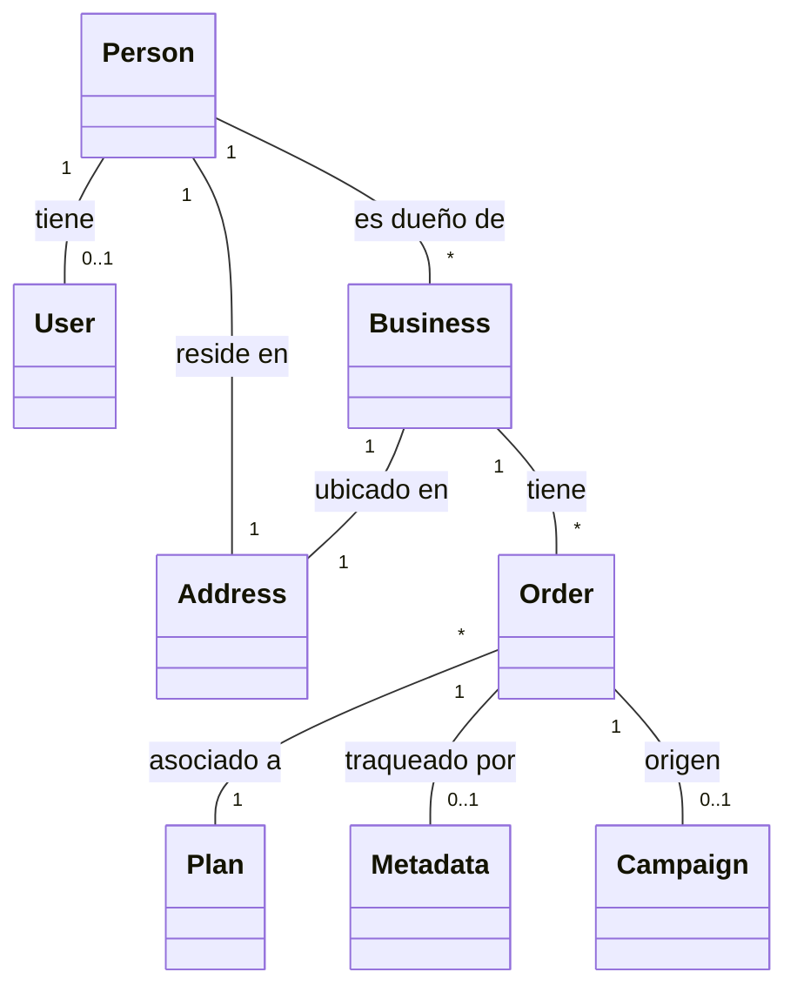

# 🚀 E-commerce Business Services - Backend (USA Business Formation)

Bienvenido a la documentación oficial del Backend de nuestra plataforma. Este sistema es una solución integral para la gestión de formación de empresas en Estados Unidos, diseñada siguiendo los principios de **Arquitectura Hexagonal (Ports & Adapters)** y estándares de ingeniería **SOLID**.

---

## 📖 1. ¿Qué es esta aplicación?

Esta plataforma automatizada ayuda a emprendedores de todo el mundo a incorporar sus negocios en EE.UU. El sistema gestiona desde la selección del plan hasta la creación segura de perfiles de usuario y la persistencia de los trámites de registro (Orders).

### Objetivos Clave:
*   **Automatización:** Registro fluido que crea usuarios y negocios en un solo paso.
*   **Validación Robusta:** Validación estricta de campos obligatorios en registros y órdenes.
*   **Manejo de Errores Centralizado:** Respuestas estandarizadas para evitar errores 500 inesperados.
*   **Seguridad:** Autenticación JWT y almacenamiento de contraseñas con BCrypt.

---

## 🔄 2. Arquitectura y Modelo de Datos

Hemos implementado una **Arquitectura Hexagonal**, separando el dominio (negocio) de la infraestructura (tecnología).

### Diagrama de Entidades (Mermaid)


### Estructura del Proyecto:
```text
src/main/java/com/nocountry/ecommerce/
│
├── 🧠 domain/                   # NÚCLEO (Reglas de Negocio)
│   ├── model/                  # Person, User, Business, Order, Plan, Address, etc.
│   └── ports/                  # Interfaces (In/Out)
│
├── 🛠️ application/              # SERVICIOS (Lógica de Aplicación)
│   └── service/                # Implementaciones (OrderServiceImpl, AuthServiceImpl)
│
└── 🔌 infrastructure/           # INFRAESTRUCTURA (Detalles Técnicos)
    ├── adapter/                
    │   ├── input/rest/         # Controladores, DTOs con validación y Mapeadores.
    │   └── output/persistence/ # JPA Entities, Repositories y Adapters.
    └── config/                 # Seguridad JWT, StripeConfig y Bean Configuration.
```

---

## 🛡️ 3. Validación y Manejo de Errores

El sistema implementa una capa de validación estricta utilizando `Jakarta Validation`:
*   **Registro/Login:** Email y contraseña obligatorios (no vacíos).
*   **Órdenes:** Todos los datos del negocio, dueño y dirección son obligatorios para garantizar documentos legales correctos.
*   **Errores Capturados:**
    *   **400 (Bad Request):** Errores de validación de campos, cuerpo de petición malformado o errores de tarjeta en Stripe.
    *   **401 (Unauthorized):** Credenciales incorrectas con mensaje claro.
    *   **409 (Conflict):** Email ya registrado.

---

## 🔐 4. Cuentas de Prueba

| Rol | Email (Username) | Contraseña | Propósito |
| :--- | :--- | :--- | :--- |
| **ADMIN** | `admin@test.com` | `password123` | Gestión total del sistema. |
| **USER** | `user@test.com` | `password123` | Usuario de ejemplo. |

> [!IMPORTANT]
> Al crear una orden nueva (`POST /api/v1/orders`), el sistema registra automáticamente al dueño como usuario y genera una **contraseña aleatoria segura** que se muestra en la respuesta JSON para que el usuario pueda loguearse luego.

---

## 📝 5. API Endpoints Principales

### Órdenes (Público/Protegido)
*   `POST /api/v1/orders`: Crea una nueva orden de registro (crea usuario y negocio automáticamente).
*   `GET /api/v1/orders`: Lista todas las órdenes (Solo ADMIN).
*   `GET /api/v1/orders/{id}`: Detalle de una orden específica.

### Autenticación
*   `POST /api/v1/auth/login`: Inicia sesión y devuelve el token JWT.
*   `POST /api/v1/auth/register`: Registro manual de usuario.

---

## 🛠️ 6. Guía de Inicio Rápido

### Requisitos
*   **Java 17** o superior.
*   **Maven 3.8+**.
*   **Docker & Docker Compose** (Para la base de datos).

### Instalación y Ejecución
1.  **Iniciar Base de Datos:**
    ```bash
    # En la raíz del proyecto (donde está el docker-compose.yml)
    docker compose up -d
    ```
2.  **Ejecutar Backend:**
    ```bash
    cd Back
    mvn spring-boot:run
    ```

### 🌍 Información de Acceso
*   **API URL:** `http://localhost:8080/api/v1`
*   **Swagger UI:** [http://localhost:8080/swagger-ui/index.html](http://localhost:8080/swagger-ui/index.html)
*   **Base de Datos:** PostgreSQL en puerto `5432` (Credenciales en `.env`).

---

## 🚀 Tecnologías Utilizadas
*   **Spring Boot 3.2+**
*   **Spring Security & JWT**
*   **PostgreSQL 16** (Dockerizada)
*   **Hibernate / JPA**
*   **Stripe SDK** (Integración de pagos)
*   **Jakarta Validation** (Anotaciones @NotBlank, @Valid)
*   **Lombok** (Generación de código)
*   **Mermaid.js** (Documentación visual)

## ❓ Guía del Usuario (Cómo usar la App)
