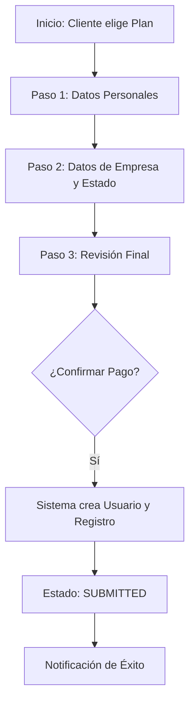
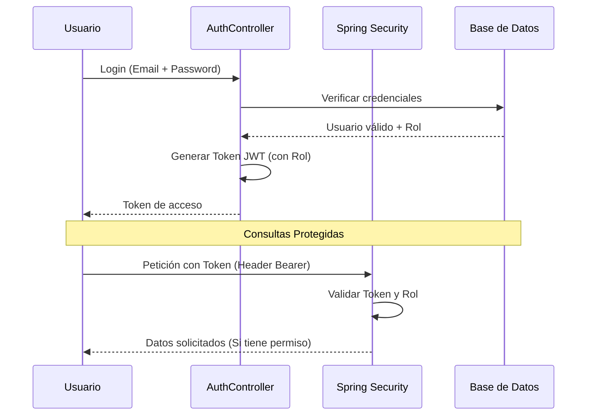

# Backend - NoCountry Ecommerce

## Overview
This is the Backend service for the NoCountry Ecommerce simulation, built with Java and Spring Boot following Hexagonal Architecture (Ports and Adapters).

## Architecture
The project follows a strict separation of concerns:
- **Domain**: Core business logic and entities (Model, Ports).
# 🚀 E-commerce Business Services - Backend (USA Business Formation)

Bienvenido a la documentación oficial del Backend de nuestra plataforma. Este sistema es una solución integral para la gestión de formación de empresas en Estados Unidos (LLC y C-Corp), diseñada con los más altos estándares de ingeniería de software.

---

## 📖 1. ¿Qué es esta aplicación?

Esta es una plataforma automatizada que ayuda a emprendedores de todo el mundo a incorporar sus negocios en EE.UU. El sistema gestiona desde la selección del plan y el estado legal, hasta la creación segura de perfiles de usuario y la persistencia de los trámites de registro.

### Objetivos Clave:
*   **Automatización:** Reducir la fricción en el proceso de registro legal.
*   **Seguridad:** Proteger la información sensible mediante cifrado y tokens.
*   **Escalabilidad:** Permitir que miles de usuarios gestionen sus trámites simultáneamente.

---

## 🔄 2. Diagramas de Flujo

Para entender mejor cómo interactúa el usuario con el sistema, hemos diseñado los siguientes diagramas:

### A. Proceso de Registro de Empresa
Este es el camino que sigue un cliente desde que elige un plan hasta que su solicitud queda guardada.



### B. Proceso de Autenticación (Seguridad JWT)
Así es como el sistema protege las rutas privadas y verifica quién es el usuario.



---

## 📂 3. Estructura Detallada del Proyecto

Hemos implementado una **Arquitectura Hexagonal**, lo que significa que el "cerebro" (negocio) está separado de las "extremidades" (tecnología: base de datos, API, seguridad).

```text
src/main/java/com/nocountry/ecommerce/
│
├── 🧠 domain/                   # REGLAS DE NEGOCIO (Lo más importante)
│   ├── model/                  # Objetos reales: User, Plan, Registration, USAState, Role.
│   ├── ports/                  # Interfaces que definen QUÉ hace el sistema.
│   │   ├── in/                 # Puertos de entrada (AuthService, RegistrationService).
│   │   └── out/                # Puertos de salida (Repositories, JwtPort).
│
├── 🛠️ application/              # LÓGICA DE APLICACIÓN (El pegamento)
│   └── service/                # Implementaciones: Registran empresas, validan contraseñas.
│
└── 🔌 infrastructure/           # INFRAESTRUCTURA (Detalles técnicos)
    ├── adapter/                
    │   ├── input/rest/         # Controladores que reciben datos del navegador (JSON).
    │   └── output/             # Cómo hablamos con H2 (Base de Datos) y JWT.
    │       ├── persistence/    # Repositorios JPA y Mapeadores de datos.
    │       └── security/       # El motor de seguridad y generación de Tokens.
    └── config/                 # Configuraciones de Spring (Seguridad, CORS, Datos iniciales).
```

---

## � 4. Guía del Usuario (Cómo usar la App)

Si eres un administrador o desarrollador probando la app, sigue estos pasos:

### Paso 1: Obtener acceso
El sistema ya tiene dos cuentas listas. Puedes "loguearte" enviando una petición al servidor.
*   **Como Admin:** Acceso total.
*   **Como Usuario:** Acceso a tus propios datos.

### Paso 2: El Registro de Empresa (Visitante)
Cualquier persona puede registrar una empresa sin estar logueada. El sistema detectará si es un usuario nuevo y le creará una cuenta automáticamente con el rol `ROLE_USER`.

### Paso 3: Gestión (Solo con Login)
Una vez que tengas tu "Token", puedes:
1.  Ver la lista de todas las empresas registradas (si eres Admin).
2.  Actualizar el estado de un registro (de "PENDIENTE" a "PAGADO").
3.  Borrar registros si es necesario.

---

## 🛠️ 6. Guía Técnica: Inicio Rápido

### Requisitos
*   **Java 17** (o superior).
*   **Maven 3.8+**.

### Instalación y Ejecución
```bash
# Entrar a la carpeta del proyecto
cd Back

# Compilar e iniciar
mvn spring-boot:run
```

### 🌍 ¿Qué ver en el navegador?
Al iniciar el servidor, puedes acceder a las siguientes URLs:

1.  **Página de Bienvenida:** [http://localhost:8080/](http://localhost:8080/) (Confirmación de que el servidor está activo).
2.  **Documentación Interactiva (Swagger):** [http://localhost:8080/swagger-ui/index.html](http://localhost:8080/swagger-ui/index.html) (¡Usa esto para probar la API visualmente!).
3.  **Consola de Base de Datos (H2):** [http://localhost:8080/h2-console](http://localhost:8080/h2-console) (Para ver las tablas y datos).

---

## 🔐 6. Cuentas de Prueba y Seguridad

| Rol | Email | Contraseña | ¿Qué hace? |
| :--- | :--- | :--- | :--- |
| **ADMIN** | `admin@test.com` | `password123` | Control total del sistema. |
| **USER** | `user@test.com` | `password123` | Usuario de ejemplo para pruebas. |

> [!IMPORTANT]
> Las contraseñas se guardan utilizando **BCrypt**, el estándar de la industria, lo que significa que ni siquiera los administradores pueden ver la contraseña real en la base de datos.

---

## 📝 7. Ejemplos de Peticiones (API Docs)

### Iniciar Sesión (Login)
```bash
curl -X POST http://localhost:8080/api/v1/auth/login \
     -H "Content-Type: application/json" \
     -d '{"email": "admin@test.com", "password": "password123"}'
```
*El sistema responderá con un campo `"token"`. Debes copiarlo para las siguientes pruebas.*

### Consultar Registros (Protegido)
```bash
curl -X GET http://localhost:8080/api/v1/registrations \
     -H "Authorization: Bearer <TU_TOKEN_PEGADO_AQUI>"
```

### Crear Registro (Público)
```bash
curl -X POST http://localhost:8080/api/v1/registrations \
     -H "Content-Type: application/json" \
     -d '{"fullName":"Juan Perez","email":"juan@perez.com","whatsapp":"+123","companyName":"Perez Corp","activity":"Dev","state":"Delaware","entityType":"LLC","planId":"Inicial_Básico"}'
```

---

## � Tecnologías
*   **Spring Boot 3.2.2**
*   **Spring Security & JWT** (Seguridad)
*   **Hibernate/JPA** (Persistencia)
*   **Lombok** (Productividad)
*   **H2 Database** (Desarrollo ágil)
