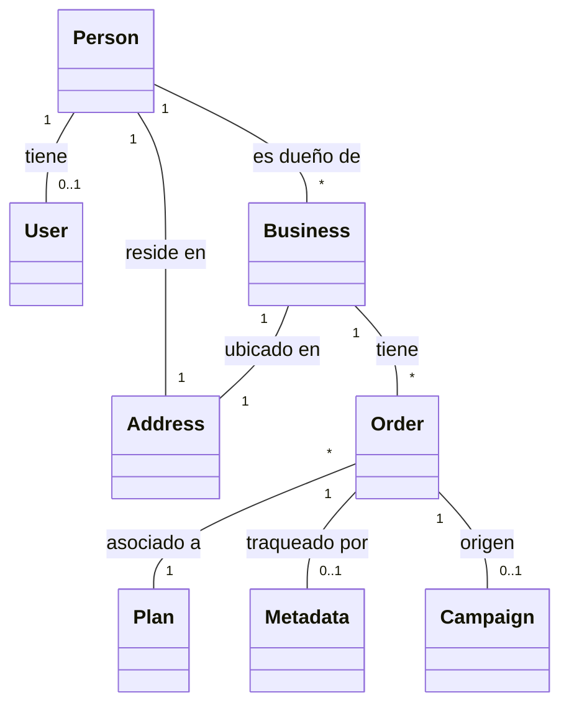

# 🚀 E-commerce Business Services - Backend (USA Business Formation)

Bienvenido a la documentación oficial del Backend de nuestra plataforma. Este sistema es una solución integral para la gestión de formación de empresas en Estados Unidos, diseñada siguiendo los principios de **Arquitectura Hexagonal (Ports & Adapters)** y estándares de ingeniería **SOLID**.

---

## 📖 1. ¿Qué es esta aplicación?

Esta es una plataforma automatizada que ayuda a emprendedores de todo el mundo a incorporar sus negocios en EE.UU. El sistema gestiona desde la selección del plan hasta la creación segura de perfiles de usuario y la persistencia de los trámites de registro (Orders).

### Objetivos Clave:
*   **Automatización:** Registro fluido que crea usuarios y negocios en un solo paso.
*   **SOLID & DRY:** Código desacoplado y reutilizable, eliminando redundancias en entidades como direcciones.
*   **Seguridad:** Autenticación JWT y almacenamiento de contraseñas con BCrypt.

---

## 🔄 2. Arquitectura y Modelo de Datos

Hemos implementado una **Arquitectura Hexagonal**, separando el dominio (negocio) de la infraestructura (tecnología).

### Diagrama de Entidades (Mermaid)


### Estructura del Proyecto:
```text
src/main/java/com/nocountry/ecommerce/
│
├── 🧠 domain/                   # NÚCLEO (Reglas de Negocio)
│   ├── model/                  # Person, User, Business, Order, Plan, Address, etc.
│   └── ports/                  # Interfaces (In/Out)
│
├── 🛠️ application/              # SERVICIOS (Lógica de Aplicación)
│   └── service/                # Implementaciones (OrderServiceImpl, AuthServiceImpl)
│
└── 🔌 infrastructure/           # INFRAESTRUCTURA (Detalles Técnicos)
    ├── adapter/                
    │   ├── input/rest/         # Controladores y Mapeadores REST.
    │   └── output/persistence/ # JPA Entities, Repositories y Adapters.
    └── config/security/        # Seguridad JWT y Configuración de App.
```

---

## � 3. Seguridad y Cuentas de Prueba

| Rol | Email (Username) | Contraseña | Propósito |
| :--- | :--- | :--- | :--- |
| **ADMIN** | `admin@test.com` | `password123` | Gestión total del sistema. |
| **USER** | `user@test.com` | `password123` | Usuario de ejemplo. |

> [!NOTE]
> Al crear una orden nueva, el sistema registra automáticamente a la persona y genera una **contraseña aleatoria segura** que se devuelve en la respuesta del API.

---

## 📝 4. API Endpoints Principales

### Órdenes (Público/Protegido)
*   `POST /api/v1/orders`: Crea una nueva orden de registro (crea usuario y negocio automáticamente).
*   `GET /api/v1/orders`: Lista todas las órdenes (Solo ADMIN).
*   `GET /api/v1/orders/{id}`: Detalle de una orden específica.

### Autenticación
*   `POST /api/v1/auth/login`: Inicia sesión y devuelve el token JWT.
*   `POST /api/v1/auth/register`: Registro manual de usuario.

---

## 🛠️ 5. Guía Técnica: Inicio Rápido

### Requisitos
*   **Java 17** o superior.
*   **Maven 3.8+**.

### Instalación y Ejecución
```bash
# Navegar a la carpeta del proyecto
cd Back

# Ejecutar la aplicación
mvn spring-boot:run
```

### 🌍 Acceso Local
1.  **Swagger UI:** [http://localhost:8080/swagger-ui/index.html](http://localhost:8080/swagger-ui/index.html) (Documentación interactiva).
2.  **Consola H2:** [http://localhost:8080/h2-console](http://localhost:8080/h2-console) (Usuario: `sa`, Password: `password`, JDBC: `jdbc:h2:mem:ecommerce`).

---

## 🛠️ Tecnologías Utilizadas
*   **Spring Boot 3.2+**
*   **Spring Security & JWT**
*   **Hibernate / JPA** (H2 Database en memoria)
*   **Lombok** (Generación de código)
*   **Mermaid.js** (Documentación visual)

## � Guía del Usuario (Cómo usar la App)


