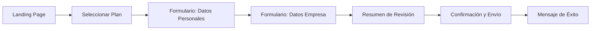
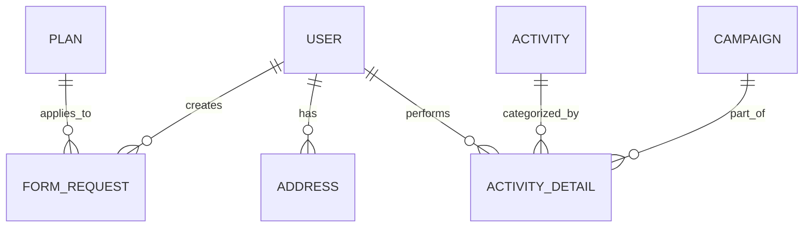
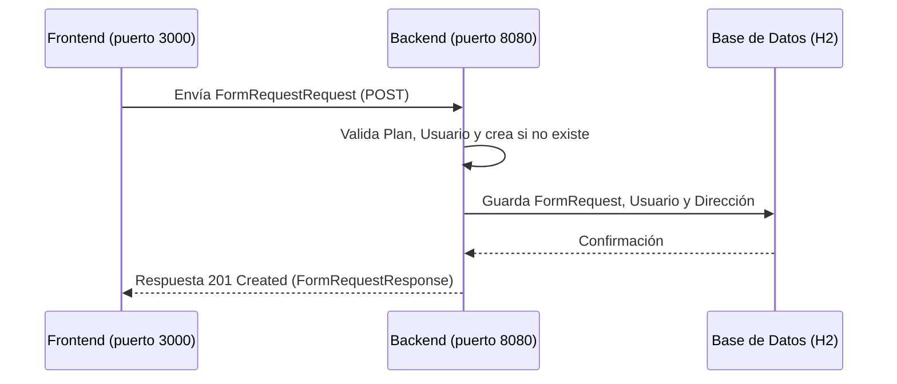

# 🚀 Full-Stack E-commerce Business Services (USA Business Formation)

Bienvenido al proyecto integral de gestión de formación de empresas en Estados Unidos. Esta plataforma permite a emprendedores globales registrar sus empresas (LLC o C-Corp) de manera sencilla, segura y profesional.

El proyecto está dividido en dos partes principales:
1.  **Backend (Java/Spring Boot)**: El cerebro que procesa los datos y la seguridad.
2.  **Frontend (Next.js/React)**: La interfaz visual e interactiva para el usuario.

---

## 📖 1. ¿Cómo funciona la aplicación? (Guía de Usuario)

Hemos diseñado una experiencia de usuario fluida dividida en pasos claros:

### 🎨 Interfaz del Cliente (Frontend)
El cliente interactúa con una aplicación web moderna y responsiva:
1.  **Selección de Plan**: El usuario elige entre los planes *Inicial*, *Crecimiento* o *Élite*.
2.  **Formulario Multi-paso**:
    *   **Paso 1 (Perfil)**: Datos personales (Nombre, Email, WhatsApp).
    *   **Paso 2 (Empresa)**: Nombre de la empresa, actividad, estado de formación (Delaware/Wyoming) y tipo de entidad (LLC/CORP).
    *   **Paso 3 (Revisión)**: Un resumen visual de toda la información para confirmar que no hay errores.
3.  **Finalización**: Al hacer clic en "Finalizar", los datos se envían de forma segura al backend y se guarda el registro.

### ⚙️ Procesamiento (Backend)
*   Recibe la solicitud del frontend.
*   Crea automáticamente una cuenta de usuario si es la primera vez que se registra.
*   Codifica la contraseña por seguridad.
*   Guarda el trámite en la base de datos con estado "SUBMITTED".

---

## 🔄 2. Diagramas de la Aplicación

### A. Experiencia del Usuario (Frontend Journey)


### B. Estructura de Datos (Relacional)


### C. Arquitectura Técnica (Flujo General)


---

## 📂 3. Estructura del Proyecto

### [Frontend (Carpeta `/Front`)](file:///home/tatiana/Escritorio/Tati%20codigo/Nocountry/S02-26-EQUIPO18-WebbApp/Front)
Construido con **Next.js 15**, **TypeScript** y **Tailwind CSS**.
*   `app/`: Contiene las páginas y rutas de la aplicación.
*   `components/`: Componentes visuales reutilizables (selectores, botones, formularios).
*   `lib/`: Lógica de validación (Zod) y constantes (datos de estados y planes).
*   `types/`: Definiciones de TypeScript para evitar errores de código.

### [Backend (Carpeta `/Back`)](file:///home/tatiana/Escritorio/Tati%20codigo/Nocountry/S02-26-EQUIPO18-WebbApp/Back)
Construido con **Java 17**, **Spring Boot 3** y **Arquitectura Hexagonal**.
*   `domain/`: Las reglas de negocio y modelos puros.
*   `application/`: Servicios que ejecutan las tareas (Login, Registro).
*   `infrastructure/`: Adaptadores para la API REST, Base de Datos y Seguridad (JWT).

---

## 🚀 4. Guía de Inicio Rápido

Para que el proyecto funcione localmente, debes ejecutar ambos servidores:

### Iniciar el Backend
```bash
cd Back
mvn spring-boot:run
```
*   **API**: [http://localhost:8080](http://localhost:8080)
*   **Swagger (Doc)**: [http://localhost:8080/swagger-ui/index.html](http://localhost:8080/swagger-ui/index.html)

### Iniciar el Frontend
```bash
cd Front
npm install
npm run dev
```
*   **Web**: [http://localhost:3000](http://localhost:3000)

---

## 🛠️ 5. Tecnologías Utilizadas

| Área | Tecnologías |
| :--- | :--- |
| **Frontend** | Next.js, React, Tailwind CSS, Zod, TypeScript. |
| **Backend** | Spring Boot, Spring Security, JWT, JPA/Hibernate. |
| **Base de Datos** | H2 (En memoria para desarrollo rápido). |
| **Documentación** | Swagger UI, Mermaid.js. |

## ✅ 6. Verificación y Pruebas

Para asegurar que todo funciona correctamente:

1.  **Backend**: Ejecuta `mvn spring-boot:run`. El sistema inicializará los planes y usuarios por defecto.
2.  **Frontend**: Ejecuta `npm run dev`.
3.  **Registro**: Navega a `http://localhost:3000`, selecciona un plan y completa el formulario. 
4.  **Confirmación**: Al finalizar, deberías ver una pantalla de éxito en la UI (en lugar de un simple alert). Los datos se envían a `/api/checkout` (Next.js) y de ahí al Backend Java.
5.  **Base de Datos**: Puedes verificar los registros persistidos consultando el endpoint protegido:
    ```bash
    # Obtener token
    curl -X POST http://localhost:8080/api/v1/auth/login -d '{"email":"admin@test.com", "password":"password123"}' -H "Content-Type: application/json"
    
    # Listar solicitudes (reemplazar TOKEN)
    curl -H "Authorization: Bearer TOKEN" http://localhost:8080/api/v1/form-requests
    ```

---
*Este proyecto está diseñado para ser seguro, escalable y visualmente atractivo.*
